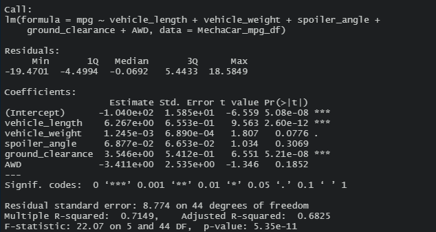
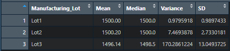
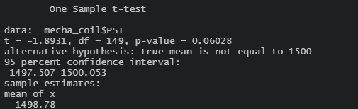
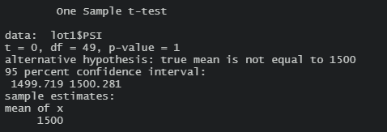
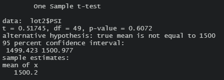
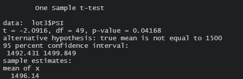

# MechaCar_Statistical_Analysis

## Linear Regression to Predict MPG

The variables that provides a non-random amount of variance to the mpg values in the dataset are vehicle_length and ground_clearance, which means those are the most significant variables. As we can see in the picture above, the p-values for vehicle_length and ground_clearance are 2.60e-12 and 5.21e-08, respectively.

According to the results, the slope of the linear model cannot be considered to be zero, caused by p-value: 5.35e-11. This means that there is sufficient evidence to reject the null hypotheses, which indicates that we can conclude that the slope is not zero.

This model has an R-squared value of 0.7149, which means that the explanatory variables explain 71% of the mpg predictions. It reflects that is accurate, although it could be better.

## Summary Statistics on Suspension Coils

The results showed that overall data, Lot 1 and Lot 2 satisfies the design specifications for having a Variance that does not exceed the 100 pounds. The only exception that is above 100 punds is the Lot 3 

## T-Tests on Suspension Coils

Reviewing the results, the T-test for the suspension coils across all manufacturing lots shows that they are not statistically different from the population mean, because the p-value is not as low enough to reject the null hypotheses.

The T-test for the suspension coils for lot 1 shows that they are not statistically different from the population mean, because the p-value is not as low enough to reject the null hypotheses.

The T-test for the suspension coils for lot 2 shows that they are not statistically different from the population mean, because the p-value is not as low enough to reject the null hypotheses.

The T-test for the suspension coils for lot 3 shows that they are slighlty statistically different from the population mean, because the p-value is greater enough to reject the null hypotheses. This lot should be evaluated to be removed or not.

## Study Design: MechaCar vs Competition

Having in mind that there are many factors that a person can considerate when evaluating a purchase of a car. Nevertheless, Many people would be interested in vehicle safety, because they want to take care of their families. In other words, they will be looking cars that can regularly transport themselves and items in a safety way.

### Metrics to Test

Safety rating: Dependent variable
Rollover crash test rating: Independent variable
Frontal crash test rating: Independent variable
Side crash test rating: Independent variable
Number of advanced safety features: Independent variable
Headlight type: Independent variable
Roof strength: Independent variable
Head restraints and seats: Independent variable

### Hypotheses: Null and Alternative

Null Hypothesis(Ho): The safety rating of MechaCar is es correctly stated based on its performance of key factors.
Alternative Hypotheses(Ha):  MechaCar safety rating  is not correctly stated based on its performance of key factors.
### Statistical Test Used
A multiple linear regression will be used to determine the variables that have the highest correlation with the safety rating and which combination has the greatest impact in the dependent variable(safety rating).

